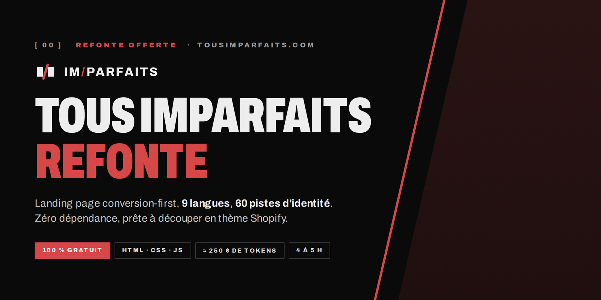
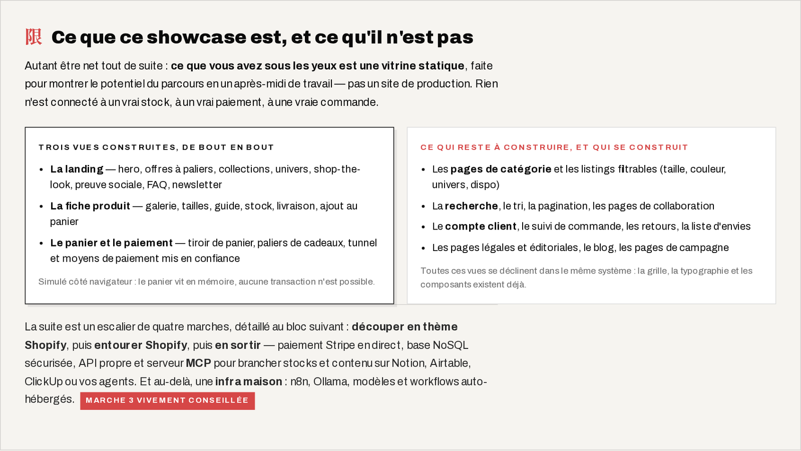
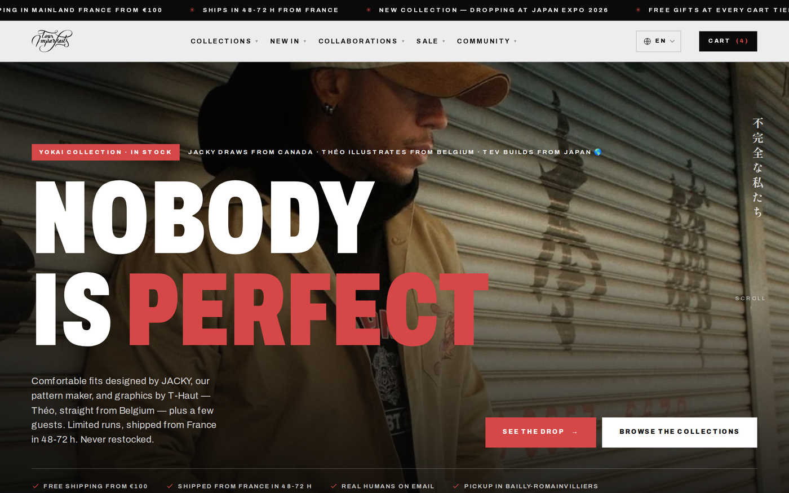
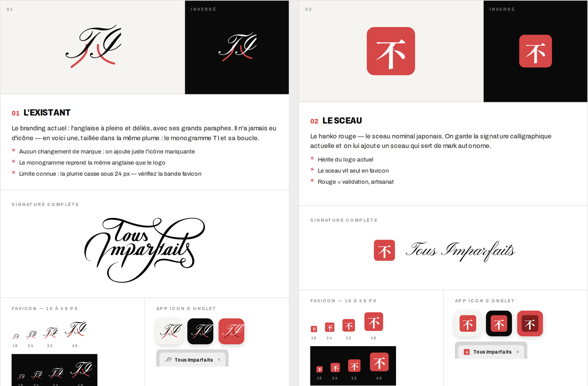
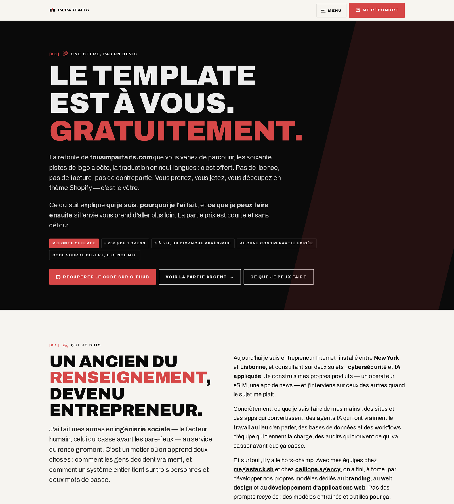
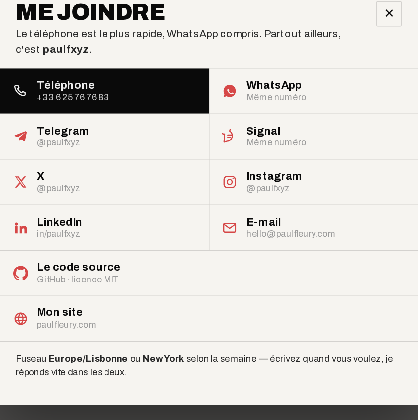
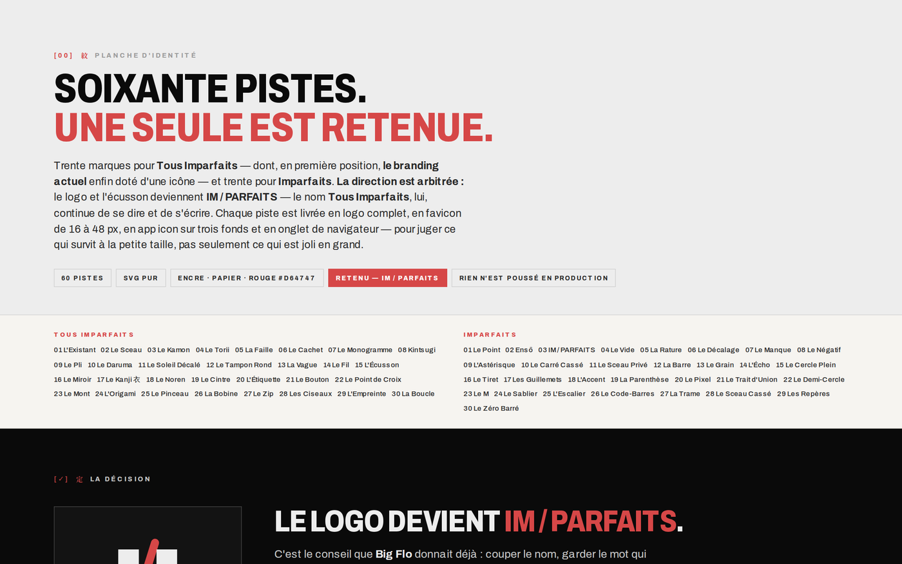
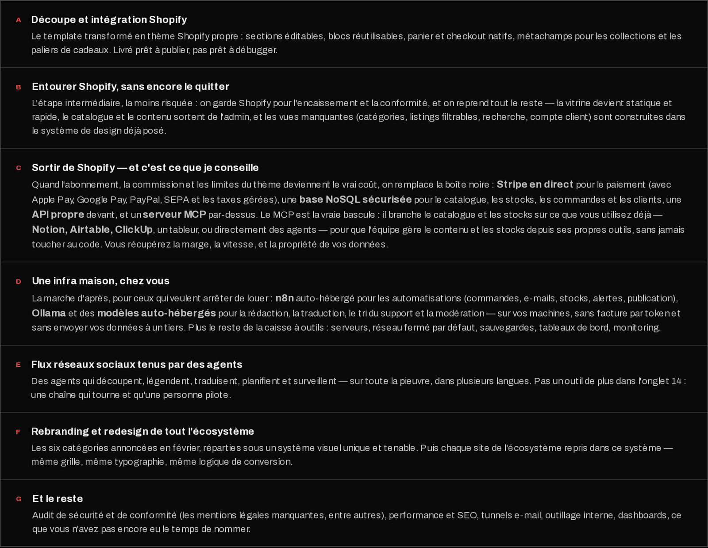

<div align="center">



<br>

**Une refonte complète de [tousimparfaits.com](https://tousimparfaits.com), offerte à [Ici Japon Corp](https://tousimparfaits.com) et à l'écosystème de [Tev](https://www.youtube.com/@IciJapon).**
Landing page conversion-first · 9 langues · 60 pistes d'identité · zéro dépendance.

Tout est en ligne, tout de suite : le site refait sur **[paulfleury.com/ti](https://paulfleury.com/ti/)**, les soixante pistes de logo sur **[paulfleury.com/ti/brand](https://paulfleury.com/ti/brand/)**, et ce que je peux faire ensuite sur **[paulfleury.com/ti/offre](https://paulfleury.com/ti/offre/)**.

Pas envie de cloner ? Le site entier se télécharge en une archive : **[paulfleury.com/ti/dump.zip](https://paulfleury.com/ti/dump.zip)** — les trois pages, les polices, les images et les neuf dictionnaires, prêts à ouvrir dans un serveur statique.

<br>

[](LICENSE)
[](offre/)
[](#-ce-que-%C3%A7a-a-co%C3%BBt%C3%A9-vraiment)
[](#-ce-que-%C3%A7a-a-co%C3%BBt%C3%A9-vraiment)

[](https://paulfleury.com/ti/)
[](https://paulfleury.com/ti/brand/)
[](https://paulfleury.com/ti/offre/)
[](https://paulfleury.com/ti/dump.zip)

[](#-internationalisation--9-langues)
[](#-la-planche-didentit%C3%A9--60-pistes)
[](#-stack-technique)
[](#-d%C3%A9marrer-en-local)
[](#-stack-technique)
[](#-stack-technique)
[](#-stack-technique)
[](#-et-apr%C3%A8s--de-la-d%C3%A9coupe-shopify-%C3%A0-linfra-maison)
[](#-ce-que-ce-showcase-est-et-ce-quil-nest-pas)
[](#-ce-que-ce-showcase-est-et-ce-quil-nest-pas)
[](#-qualit%C3%A9--ce-qui-a-%C3%A9t%C3%A9-v%C3%A9rifi%C3%A9)
[](#-stack-technique)

**[→ Voir la démo](https://paulfleury.com/ti/)** &nbsp;·&nbsp; **[→ Les 60 pistes de logo](https://paulfleury.com/ti/brand/)** &nbsp;·&nbsp; **[→ L'offre](https://paulfleury.com/ti/offre/)** &nbsp;·&nbsp; **[↓ Télécharger le site](https://paulfleury.com/ti/dump.zip)**

</div>

---

## 📋 Le résumé

`Tous Imparfaits` est la marque de vêtements d'[Ici Japon Corp](https://tousimparfaits.com), lancée en juillet 2021 autour de la chaîne de **Tev**. En février 2026, dans la vidéo [« On doit recommencer Tous Imparfaits »](https://www.youtube.com/watch?v=OPY3aPZYZRU), l'équipe pose publiquement son problème : le branding ne tient plus, aucun logo ne fonctionne sur l'ensemble des produits, et la boutique doit être repensée en catégories claires.

Ce dépôt est **ma réponse, non sollicitée et gratuite**, à cette vidéo. Trois livrables :

| # | Livrable | Ce que c'est | Où le voir |
|---|---|---|---|
| **1** | **La landing page** | Refonte complète et statique de la boutique, orientée conversion : hiérarchie de l'offre, preuve sociale, objections traitées, panier et paiement mis en confiance | **[→ paulfleury.com/ti](https://paulfleury.com/ti/)**<br>[](index.html) |
| **2** | **La planche d'identité** | 60 pistes de logo générées et documentées — 30 pour « Tous Imparfaits », 30 pour « Imparfaits » — chacune déclinée en logo, favicon 16→48 px, app icon et onglet de navigateur | **[→ paulfleury.com/ti/brand](https://paulfleury.com/ti/brand/)**<br>[](brand/) |
| **3** | **La page d'offre** | Ce que je peux faire ensuite pour l'écosystème, et comment je me rémunère. Sans engagement, sans devis | **[→ paulfleury.com/ti/offre](https://paulfleury.com/ti/offre/)**<br>[](offre/) |

> **Aucune contrepartie n'est attendue.** Le code est sous MIT : prenez-le, découpez-le, jetez-le, revendez-le. C'est le vôtre.

---

## 🔍 Ce que ce showcase est, et ce qu'il n'est pas

Autant être net d'entrée : **ce dépôt est une vitrine statique**, faite pour montrer le potentiel du parcours en un après-midi de travail — **pas un site de production**. Rien n'est connecté à un vrai stock, à un vrai paiement, à une vraie commande. Le panier vit en mémoire dans le navigateur ; aucune transaction n'est possible.

**Trois vues sont construites, de bout en bout :**

| Vue | Ce qui est réellement implémenté |
|---|---|
| **La landing** | Hero, offres à paliers, 7 collections, 8 produits, univers épinglé, shop-the-look, Pack Mystère, collaborations, communauté, FAQ, newsletter |
| **La fiche produit** | Galerie, sélection de taille, guide des tailles, état de stock, promesse de livraison, ajout au panier |
| **Le panier et le paiement** | Tiroir de panier, paliers de cadeaux, tunnel et moyens de paiement mis en confiance |

**Ce qui reste à construire** — et qui se construit dans le même système, puisque la grille, la typographie et les composants existent déjà :

- Les **pages de catégorie** et les listings filtrables (taille, couleur, univers, disponibilité)
- La **recherche**, le tri, la pagination, les pages de collaboration
- Le **compte client**, le suivi de commande, les retours, la liste d'envies
- Les pages légales et éditoriales, le blog, les pages de campagne

Autrement dit : les trois vues les plus difficiles et les plus décisives pour la conversion sont faites ; le reste est du déclinage. La suite est décrite plus bas dans [**Et après**](#-et-après--de-la-découpe-shopify-à-linfra-maison).

<div align="center">

<br><em>Le périmètre annoncé noir sur blanc sur la page d'offre — ce qui est fait, ce qui reste à faire</em>
</div>

<br>

<div align="center">

<br><em>1 — La landing page refondue</em>
</div>

<br>

<div align="center">

<br><em>2 — Chaque piste jugée là où les logos cassent vraiment : à 16 px</em>
</div>

<br>

<div align="center">

<br><em>3 — La page d'offre</em>
</div>

<br>

<div align="center">

<br><em>La modal de contact — neuf canaux, du téléphone au dépôt, en <code>&lt;dialog&gt;</code> natif</em>
</div>

---

## 🎯 Le parti pris de design

La direction est une **refonte audacieuse**, pas un lifting. Trois principes :

**1 — L'encre, le papier, un seul rouge.** Le site d'origine empile violet, vert, rouge, turquoise selon les univers produit. Ici, la palette se réduit à trois neutres et **un seul accent saturé** (`#d64747`, échantillonné sur le site réel) réservé aux appels à l'action et aux offres. Tout le reste porte l'information par la typographie et l'espace.

**2 — La typographie comme image.** Titres en grotesque comprimé (`wdth 62–70`) qui reprend le squelette Interstate Compressed du site réel, avec un mot pivot en rouge sur chaque titre — un seul procédé d'emphase, répété partout. Les kickers japonais (侍, 妖怪, 浴衣, 福袋) sont composés en Shippori Mincho : ils portent la japonité sans jamais la caricaturer.

**3 — La barre oblique.** Un seul motif graphique traverse les trois pages : la barre inclinée qui devient l'écusson `IM/PARFAITS`. Elle sert de séparateur, de fond de section et de signature — jamais un `<hr>` neutre.

### Palette

| Rôle | Hex | Usage |
|---|---|---|
| Encre | `#0a0a0a` | fonds sombres, texte principal |
| Encre 2 | `#282828` | texte secondaire, bordures inversées |
| Papier | `#ededed` | fond clair, texte sur sombre |
| Papier chaud | `#f6f4f0` | fonds de section alternés |
| Gris | `#9b9b9b` | méta, légendes |
| **Accent** | **`#d64747`** | CTA, offres, mot pivot — et rien d'autre |

---

## 🌍 Internationalisation — 9 langues

Traduction intégrale de l'interface, **766 clés par langue**, sans framework : un dictionnaire JSON par langue et un runtime de 16 ko qui remplace les nœuds texte, les `placeholder`, les `aria-label` et les `<html lang>`.

| Langue | Code | Dictionnaire |
|---|---|---|
| 🇫🇷 Français (source) | `fr` | [`assets/i18n/fr.json`](assets/i18n/fr.json) |
| 🇬🇧 Anglais | `en` | [`assets/i18n/en.json`](assets/i18n/en.json) |
| 🇯🇵 Japonais | `ja` | [`assets/i18n/ja.json`](assets/i18n/ja.json) |
| 🇨🇳 Chinois simplifié | `zh` | [`assets/i18n/zh.json`](assets/i18n/zh.json) |
| 🇰🇷 Coréen | `ko` | [`assets/i18n/ko.json`](assets/i18n/ko.json) |
| 🇪🇸 Espagnol | `es` | [`assets/i18n/es.json`](assets/i18n/es.json) |
| 🇩🇪 Allemand | `de` | [`assets/i18n/de.json`](assets/i18n/de.json) |
| 🇳🇱 Néerlandais | `nl` | [`assets/i18n/nl.json`](assets/i18n/nl.json) |
| 🇮🇹 Italien | `it` | [`assets/i18n/it.json`](assets/i18n/it.json) |

Détails qui ont demandé du soin :

- **Les noms de marque ne se traduisent jamais.** « Tous Imparfaits », « Ici Japon », « Néo Samouraï », les noms de collection et les collaborations restent intacts dans les neuf langues.
- **Le « Pack Mystère » garde son mot français.** `Mystère福袋` en japonais, `Mystère 盲盒` en chinois, `Mystère 박스` en coréen, `Mystère-Paket` en allemand : le mot latin est conservé comme élément de marque, le contenant est traduit — et le clin d'œil au *fukubukuro* japonais est explicité dans chaque langue.
- **Détection automatique** de la langue du navigateur, choix mémorisé, et repli propre sur le français si le stockage local est indisponible.
- **Les prix restent en euros** partout : la boutique expédie depuis la France, changer la devise sans changer la logistique serait un mensonge d'interface.

---

## 🎨 La planche d'identité — 60 pistes

Le vrai problème posé dans la vidéo n'est pas « le logo est laid », c'est « **aucun logo ne marche partout** ». Une anglaise calligraphique à pleins et déliés est magnifique sur une étiquette et illisible à 16 px dans un onglet.

La planche répond en générant **60 pistes en SVG pur** (aucune image bitmap), chacune présentée dans les quatre situations où un logo se casse réellement :

```
logo complet   →   favicon 16 · 24 · 32 · 48 px   →   app icon sur 3 fonds   →   onglet de navigateur
```

Aucune piste n'est un bitmap : chaque marque est un tracé SVG de quelques centaines d'octets, ce qui la rend broderie-compatible, gravable, et lisible à n'importe quelle taille sans jamais réexporter un fichier.

```
brand/
├── index.html              ← la planche complète, 60 pistes
└── styles.css
```

**La direction retenue** est la piste `IM / PARFAITS` : le nom parlé, écrit et vendu reste *Tous Imparfaits* — c'est **le logo et l'écusson** qui se resserrent, en appliquant le conseil que Big Flo donnait déjà dans la vidéo (couper le nom, garder le mot qui porte). Le mark garde la blague : l'écusson affiche *je suis parfait* sur le dos de gens qui répètent que personne ne l'est.

<div align="center"><br>

</div>

---

## 🛠 Stack technique

Volontairement minimale — parce que le but est qu'un développeur Shopify puisse la reprendre sans rien apprendre.

| Couche | Choix | Pourquoi |
|---|---|---|
| **Structure** | HTML5 sémantique, statique | découpable en sections Liquid ligne par ligne |
| **Style** | CSS moderne, variables natives, `clamp()`, grid & flex | **aucun préprocesseur, aucun Tailwind, aucun build** |
| **Comportement** | JavaScript vanilla ES5-compatible, `< 20 ko` non minifié | panier, filtres, accordéons, drawer, langue, modales |
| **Dialogues** | `<dialog>` natif — modal de contact à 9 canaux | fermeture au fond, à l'Échap, focus restauré, sans librairie |
| **Typographie** | Archivo Variable (`wght` 100–900, `wdth` 62–125) + Shippori Mincho | 2 fichiers `woff2`, axes variables, `font-display` maîtrisé |
| **Sous-ensemble de police** | Shippori Mincho réduit aux 51 glyphes JP réellement utilisés | **204 ko de polices au total** au lieu de plusieurs Mo |
| **Images** | WebP, `loading="lazy"`, dimensions déclarées | pas de saut de mise en page, pas de CDN tiers |
| **i18n** | JSON + runtime maison de 16 ko | pas de i18next, pas de build de traduction |
| **Identité** | 60 marques en SVG pur, aucun bitmap | broderie, gravure, favicon 16 px — la même source |
| **QA** | navigateur automatisé, 3 viewports × 9 langues | débordements, erreurs console, chargement des polices |
| **Dépendances d'exécution** | **zéro** | aucun `npm install`, aucun CDN, aucun tracker |

### Ce qu'il n'y a pas, exprès

Pas de React, pas de jQuery, pas de Bootstrap, pas de Google Fonts en ligne, pas de Font Awesome, pas de cookie tiers, pas de pixel de tracking, pas de `node_modules`. Toutes les icônes sont des SVG inline.

Et aussi : **pas de backend, pas de base de données, pas d'API**. C'est volontaire à ce stade — voir [le périmètre du showcase](#-ce-que-ce-showcase-est-et-ce-quil-nest-pas). Tout ça arrive aux marches 3 et 4.

---

## 💰 Ce que ça a coûté, vraiment

Par transparence, puisque le travail est offert et que la [page d'offre](https://paulfleury.com/ti/offre/) parle d'argent.

| Poste | Montant |
|---|---|
| **Tokens consommés par mes modèles** | **≈ 250 $** d'usage réel mesuré |
| **Temps humain** | **4 à 5 h** — un dimanche après-midi : cadrage, recherche, direction artistique, arbitrages, relecture, QA |
| **Facturé à Ici Japon Corp** | **0 €** |

**Aucune image n'a été générée par IA.** Toutes les photographies produit viennent du site réel — c'est un choix : une refonte se juge sur les vrais visuels de la marque, pas sur des rendus flatteurs qui n'existeront jamais en boutique.

---

## ✅ Qualité — ce qui a été vérifié

- **0 débordement horizontal** aux trois viewports (1440 / 1024 / 390 px) sur les trois pages, dans les neuf langues
- **0 erreur console** sur les trois pages
- **Polices chargées** et vérifiées via `document.fonts.check()` — pas de FOIT silencieux
- **`overflow-x: clip`** et non `hidden` sur `html`/`body` — pour ne pas casser `position: sticky`
- Navigation **au clavier** : `:focus-visible` sur tous les éléments interactifs, modale avec `Échap`, clic sur le fond, et retour du focus
- **`prefers-reduced-motion`** respecté : toutes les animations et transitions coupées
- Contrastes visant **WCAG AA** sur les textes courants
- `aria-label`, `aria-haspopup`, `aria-hidden` sur les icônes décoratives, `scroll-margin-top` sur les ancres

---

## 🚀 Démarrer en local

Aucun build, aucune dépendance. Un serveur statique suffit.

```bash
git clone https://github.com/paulfxyz/imparfaits.git
cd imparfaits

python3 -m http.server 8080
# → http://localhost:8080/          la landing page
# → http://localhost:8080/brand/    les 60 pistes d'identité
# → http://localhost:8080/offre/    l'offre
```

Sans git, l'archive fait la même chose :

```bash
curl -O https://paulfleury.com/ti/dump.zip
unzip dump.zip -d imparfaits && cd imparfaits
python3 -m http.server 8080
```

### Arborescence

```
.
├── index.html              ← la landing page
├── styles.css
├── app.js                  ← panier, filtres, drawer, accordéons
├── assets/
│   ├── i18n/               ← 9 dictionnaires × 766 clés
│   ├── i18n.js             ← le runtime de traduction
│   ├── fonts/              ← Archivo Variable + Shippori Mincho (sous-ensemble)
│   ├── pay/                ← icônes de paiement en SVG
│   ├── *.webp              ← photographies produit (© Ici Japon Corp)
│   └── asset-manifest.md   ← chaque asset, sa source, son usage
├── brand/                  ← la planche : 60 pistes d'identité en SVG
├── offre/                  ← la page d'offre
└── LICENSE
```

Le fichier [`assets/asset-manifest.md`](assets/asset-manifest.md) documente **la provenance de chaque asset, texte, prix et couleur** : rien n'a été inventé, tout est traçable jusqu'au site réel.

---

## 🛍 Et après : de la découpe Shopify à l'infra maison

Quatre marches, par ordre croissant d'engagement — et d'autonomie retrouvée.

| Marche | Ce qu'on fait | Ce que ça change |
|:--:|---|---|
| **1** | **Découper en thème Shopify** | Sections éditables, blocs réutilisables, panier et checkout natifs, métachamps par univers. Livré prêt à publier. |
| **2** | **Entourer Shopify** | On garde Shopify pour l'encaissement et la conformité, on reprend tout le reste : vitrine statique et rapide, catalogue et contenu sortis de l'admin, vues manquantes construites. Le moins risqué. |
| **3** | **Sortir de Shopify** — 👍 **vivement conseillé** | **Stripe en direct** (Apple Pay, Google Pay, PayPal, SEPA, taxes), **base NoSQL sécurisée** pour catalogue / stocks / commandes / clients, **API propre**, et un **serveur MCP** par-dessus pour brancher stocks et contenu sur **Notion, Airtable, ClickUp**, un tableur ou directement des agents. La marge, la vitesse et la propriété des données reviennent à la maison. |
| **4** | **Une infra in-house** | **n8n** auto-hébergé pour les automatisations (commandes, e-mails, stocks, alertes, publication), **Ollama** et des **modèles auto-hébergés** pour la rédaction, la traduction, le tri du support et la modération. Sur vos machines : pas de facture au token, pas de données chez un tiers. Plus serveurs, réseau fermé par défaut, sauvegardes, monitoring. |

La marche 3 est celle que je recommande : le MCP est la vraie bascule, parce qu'il rend la boutique pilotable depuis les outils que l'équipe utilise déjà, sans jamais toucher au code.

<div align="center">

<br><em>Les mêmes marches, détaillées sur la page d'offre</em>
</div>

### Marche 1 en détail — le mapping Liquid

La page est écrite pour être découpée. Le mapping évident :

| Section de la page | Section Liquid |
|---|---|
| En-tête + drawer panier | `sections/header.liquid` + `snippets/cart-drawer.liquid` |
| Hero | `sections/image-banner.liquid` |
| Grille produits par univers | `sections/featured-collection.liquid` (une par catégorie) |
| Bandeaux défilants | `sections/announcement-bar.liquid` |
| Preuve sociale / avis | `sections/testimonials.liquid` (bloc custom) |
| FAQ / objections | `sections/collapsible-content.liquid` |
| Pied de page | `sections/footer.liquid` |
| i18n | à remplacer par les **Shopify Markets + Translate & Adapt** natifs |

Les six catégories annoncées dans [« On doit recommencer Tous Imparfaits »](https://www.youtube.com/watch?v=OPY3aPZYZRU) peuvent devenir six collections Shopify avec un `metafield` de couleur d'univers, ce qui rend la grille pilotable depuis l'admin sans toucher au code.

**Je peux faire ce découpage.** C'est le premier point de la [page d'offre](https://paulfleury.com/ti/offre/).

### Sur le long terme, comment je travaille

La [page d'offre](https://paulfleury.com/ti/offre/#argent) propose quatre façons de faire, dont une qui dépasse la prestation : un **fixe mensuel à trois fois le SMIC brut** (≈ 5 600 € sur la base du [SMIC au 1ᵉʳ juin 2026](https://code.travail.gouv.fr/actualite/le-smic-augmente-au-1er-juin-2026-etes-vous-concerne)) plus des **actions ou un intéressement** sur les projets où mon impact est mesurable.

Ce que ça veut dire en pratique, parce que c'est la partie qui compte :

- **Sans deadline.** Aucun rétro-planning tendu, aucun sprint, aucune pression de part et d'autre.
- **En temps très partiel, mais régulièrement.** Tranquillement, sur mon temps libre, en alternance avec mes propres boîtes — et ça avance chaque semaine plutôt que par à-coups.
- **Sur tous les détails et tous les projets souhaités.** Périmètre ouvert : le site, la marque, les automatisations, l'infra, les petits trucs qui traînent depuis deux ans.
- **Un rapport prix / qualité / délai très efficace.** C'est exactement ce que démontre ce dépôt : les modèles absorbent le volume, je n'arbitre que le goût et les priorités.
- **Sans deadline ne veut pas dire à petit impact.** C'est l'inverse : le temps que je ne passe pas à tenir un planning, je le passe sur le fond — améliorer ce qui tourne, **refonder** ce qui ne tient plus, **innover** là où personne n'a eu le temps de regarder.
- **Sur toutes les entités, sans limite de sujet.** La boutique, la marque, les chaînes, l'esport, les outils internes, ce qui n'existe pas encore — et côté technique : web, design, infrastructure, données, IA, automatisation, sécurité. Un an de ce régime change une boîte beaucoup plus qu'un trimestre de sprints.

---

## 🙋 Qui a fait ça

**Paul Fleury** — ancien de l'ingénierie sociale au service du renseignement, aujourd'hui entrepreneur Internet entre **New York** et **Lisbonne**, consultant sur deux sujets : **cybersécurité** et **IA appliquée**.

Je construis mes propres produits — [Openline](https://openline.com) (opérateur eSIM), [cupof.news](https://cupof.news) (app de news) — et je travaille avec mes équipes chez [megastack.sh](https://megastack.sh) (infrastructure et déploiement), [calliope.agency](https://calliope.agency) (branding, web et IA) et [enki.ngo](https://enki.ngo) (IA locale et décentralisée). J'interviens sur les produits des autres quand le sujet me plaît. Celui-là me plaît depuis 2020.

### Pourquoi un après-midi suffit

Avec mes équipes chez **[megastack.sh](https://megastack.sh)** et chez **[calliope.agency](https://calliope.agency)**, on a fini, à force, par développer nos propres modèles dédiés au **branding**, au **web design** et au **développement d'applications web**. Pas des prompts recyclés : des modèles entraînés et outillés pour ça, d'une efficacité assez folle. Ils tournent déjà sur mes propres boîtes — Openline, cupof.news — et sur les projets de nos clients.

Ce dépôt est ce que ça donne : **≈ 250 $ de tokens et 4 à 5 h dessus** — un dimanche après-midi. Et là il n'est question que de design et de front — pas encore du reste, le développement lourd, les infrastructures, les automatisations et les workflows.

Alors je me suis dit : tiens, je vais proposer de donner un coup de pouce à **Tev** et à l'équipe. 🤝

> **Une précision, pour éviter le malentendu.** Je ne cherche pas à devenir influenceur et je ne souhaite pas apparaître à l'écran : je travaille pour des gouvernements, de grands groupes et des personnes politiquement exposées, et dans ce métier la visibilité personnelle est un risque plutôt qu'une récompense. Être cité par mon prénom, **Paul**, ou par mon surnom, **Polo**, ne me pose aucun problème — au-delà, non. **À part mes marques (Openline, cupof.news), rien sur moi en particulier.** Et ce travail n'est pas à présenter comme une offre de consulting pour PME ou pour créateurs : ce n'est ni mon marché ni mon fonds de commerce. C'est un coup de main à **Tev et à l'univers autour** — Odysée, l'esport, la bouffe, le merch — et à personne d'autre.

[](https://paulfleury.com)
[](https://www.linkedin.com/in/paulfxyz/)
[](https://x.com/paulfxyz)
[](https://t.me/paulfxyz)
[](mailto:hello@paulfleury.com)

---

## 📄 Droits

**Le code est sous [licence MIT](LICENSE)** — faites-en ce que vous voulez.

**Ce qui ne m'appartient pas ne l'est pas :** les photographies produit, le logo et le nom « Tous Imparfaits » restent la propriété d'**ICI JAPON CORP (SASU)**. Ils sont présents ici uniquement pour démontrer la refonte sur les vrais contenus de la marque, et **je les retire sur simple demande**. Les polices Interstate du site d'origine (Adobe Fonts) ne sont **pas** redistribuées ; Archivo et Shippori Mincho sont sous SIL Open Font License 1.1.

Ce dépôt est un travail personnel, **non affilié à Ici Japon Corp et non commandité**.

<div align="center">
<br>
<sub><b>Personne n'est parfait.</b> C'est écrit sur vos vêtements depuis 2021 — et c'est aussi la meilleure raison de refaire un site.</sub>
<br><br>
</div>
